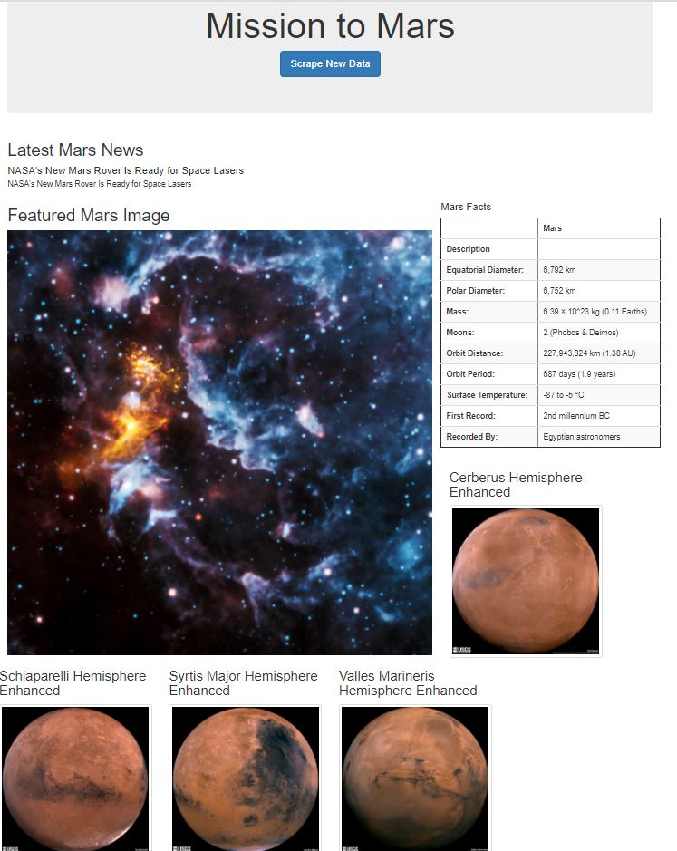

# Mission-to-Mars

## Process Outline 
1. Automate web scraping to extract data about the Mission to Mars. 
  - Latest News 
  - HTML Table about Mars Facts 
  - Featured Image 
  - Four Mars Hemisphere Photos 
2. Storing various data in web application created with Flask. 
3. Rendering the data in a web application created with Flask. 
4. Displaying webpages with Bootstrap HTML, CSS framework. 

## Results
The Homepage of my web-application 

